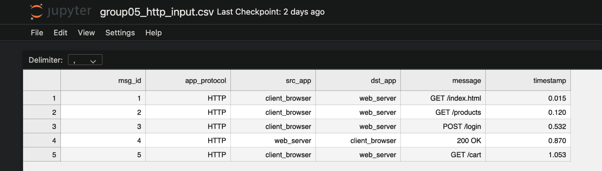
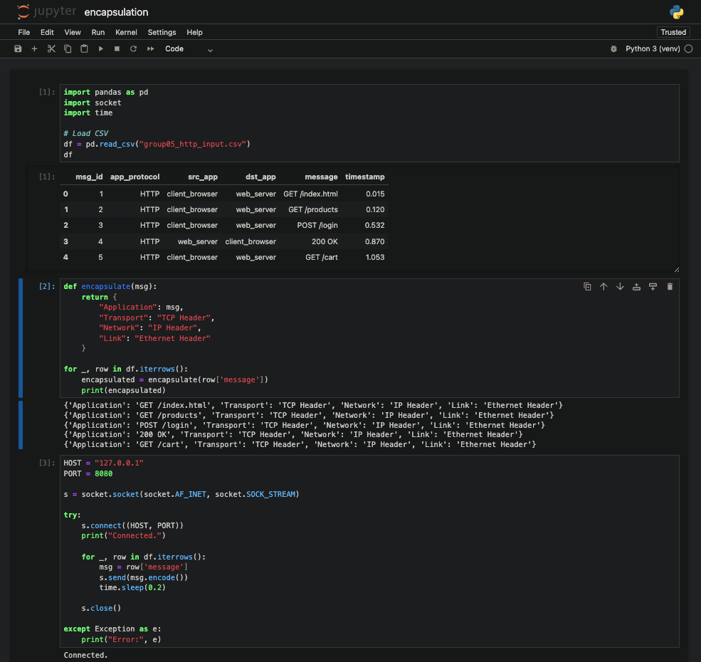

# Report - Part 1: Encapsulation & Traffic Analysis

## 1. Introduction
This section demonstrates how application-level messages are encapsulated through the TCP/IP networking stack.
The process includes loading input messages from CSV, constructing packet headers, sending packets through a socket, and analyzing them in Wireshark.

## 2. CSV Input Structure
The input CSV contains the following columns:
- `msg_id`
- `app_protocol`
- `src_app`
- `dst_app`
- `message`
- `timestamp`




## 3. Encapsulation Workflow

Each message is mapped through 4 layers of the TCP/IP model:

1. **Application Layer**: The message is read from the CSV file.
2. **Transport Layer**: A TCP header is created, including source and destination ports.
3. **Network Layer**: An IP header is added, containing source and destination IP addresses.
4. **Link Layer**: The packet is framed for transmission over the physical network.

Encapsulation Output (Jupyter Notebook):

```python
Application: "GET /index.html"
Transport: "TCP Header"
Network: "IP Header"
Link: "Ethernet Header"
```



## 4. Packet Transmission

Messages are encoded and transmitted using a TCP socket on `127.0.0.1`.
Wireshark listens on the loopback interface to capture traffic.

Key points:

- Loopback traffic is local to the machine.
- TCP handshake may appear (SYN, SYN/ACK, ACK).
- PSH/ACK packets contain the actual payload.

## 5. Wireshark Analysis

In Wireshark, each packet includes:

- Ethernet header (dummy on loopback)
- IP header
- TCP header (ports, flags, sequence/ack numbers)
- Application message (in the payload)

Student must show:

- 3-way handshake
- Payload delivery (PSH/ACK)
- Connection tear-down (FIN or RST)


## 6. Summary

This part shows full encapsulation and real network-level packet inspection, demonstrating how data travels through the TCP/IP model from application message → packet → Wireshark capture.
