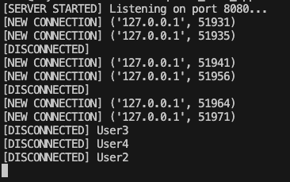
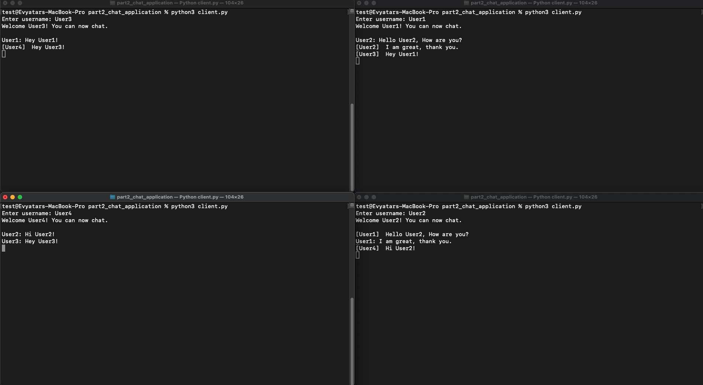
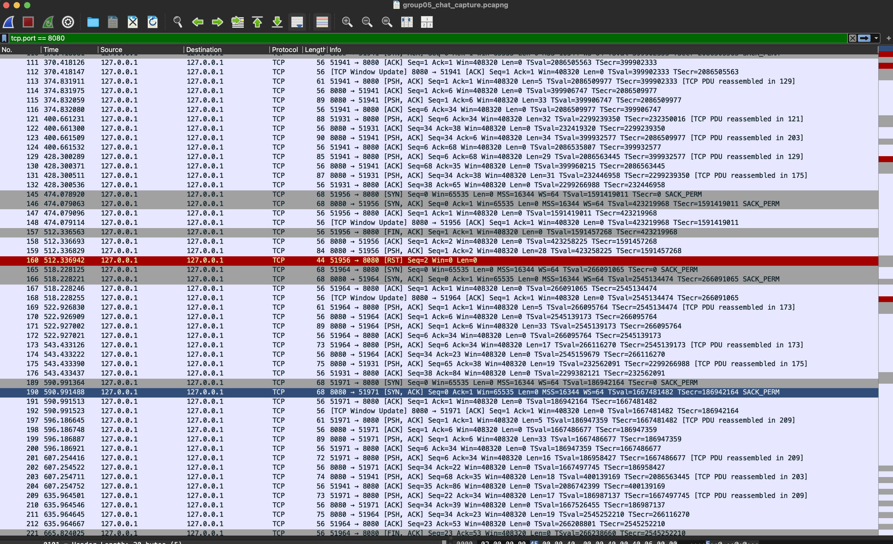

# Report - Part 2: TCP Chat Application

## 1. Introduction
This part demonstrates the implementation of a multi-client chat system using **TCP sockets**.  
The server supports multiple simultaneous connections using a **thread-per-client** model, and clients can exchange messages in real time through the server.

The goal is to show understanding of:
- TCP communication
- Socket programming
- Concurrency via threads
- Network traffic behavior (analyzed using Wireshark)

## 2. System Architecture

### 2.1 Server Responsibilities
- Accept incoming TCP connections.
- Create a new thread for each connected client.
- Maintain a dictionary of active clients:  
  `clients = { username: socket }`
- Route messages according to:  
  **sender → server → target client**
- Detect and handle client disconnections.

### 2.2 Client Responsibilities
- Connect to the server at port **8080**.
- Provide a username.
- Send messages in the format:  
  `target_username: message`
- Receive messages routed by the server.

## 3. Installation & Execution Instructions

## How to Download:

1. Clone the repository:

   ```bash
   git clone https://github.com/Evyatarashuri/networking-project-tcpip-2025.git
   cd networking-project-tcpip-2025
    ```

2. Create a virtual environment and activate it:

   ```bash
   python3 -m venv venv
   source venv/bin/activate
   ```

3. Install the required packages:

   ```bash
   pip3 install -r requirements.txt
   ```

---

## How to Run:

### Part 1 – Encapsulation & Traffic Analysis

1. Open the Jupyter Notebook:

   ```bash
   jupyter notebook
   ```

2. Navigate to:

   ```
   part1_csv_encapsulation/encapsulation_notebook.ipynb
   ```

3. Run all cells:

- Loads CSV input
- Generates encapsulated TCP messages
- Saves results
- Produces Wireshark-capturable traffic

4. Open the generated `.pcapng` file in Wireshark for analysis.

### Part 2 – TCP Chat Application

**Start the Server**

Run the server:

```bash
python3 part2_chat_application/server.py
```

**Run Multiple Clients**

Each client runs in a separate terminal window:

```bash
python3 part2_chat_application/client.py
```

You will be prompted:
```bash
Enter username:
```

**Message Format**

Messages must follow this structure:

```bash
target_username: message
```

Example:
```bash
User2: Hey, how are you?
```

## 4. Example Session

### 4.1 Server Output

```python
[SERVER STARTED] Listening on port 8080...
[NEW CONNECTION] ('127.0.0.1', 51931)
[NEW CONNECTION] ('127.0.0.1', 51935)
[DISCONNECTED] User3
```

Screenshot:




### 4.2 Multiple Clients Connected

Each client sends messages and receives routed responses.

Screenshot:


## Input & Output Examples

### 4.3 Client Input Example

```bash
Enter username: User1
User2: Hey, how are you?
User3: Are you joining the chat?
```

### 4.4 Client Output Example

```bash
Welcome User1! You can now chat.
[User2] Hey, how are you?
[User3] Are you joining the chat?
```

### 4.5 Server Output Example

```bash
[SERVER STARTED] Listening on port 8080...
[NEW CONNECTION] ('127.0.0.1', 51931)
[NEW CONNECTION] ('127.0.0.1', 51935)
[User1 → User2]: Hey, how are you?
[DISCONNECTED] User3
```

## 5. Wireshark TCP Analysis (Chat Application)

Traffic was captured on the Loopback interface (lo0) using the filter:

```bash
tcp.port == 8080
```

- SYN, SYN/ACK, ACK handshake
- PSH/ACK packets containing chat messages
- Multiple simultaneous TCP connections (different source ports)

Screenshot:


## 6. Concurrency Model

The server uses:

```python
thread = threading.Thread(target=handle_client, args=(conn, addr))
thread.start()
```

Each client gets its own thread → enabling simultaneous communication.
This satisfies the requirement:
"The server must support at least 5 clients concurrently."

## 7. Database Choice

The server maintains an in-memory dictionary that stores the mapping between each connected username and its associated TCP socket.

```bash
clients = {
    username: client_socket
   }
```
This allows efficient message routing without the overhead of a persistent database, suitable for the chat application's real-time requirements.

## 8. Summary
This part demonstrates:

- Multiplexing of multiple TCP connections
- Thread-based concurrency
- Real packet inspection of live chat traffic
- End-to-end message routing logic
